# Introducción a Amazon AWS

## Tabla de contenidos
---
- Introducción al entorno de prácticas
- Creación de una instancia UBUNTU 14.04 LTS(HVM)
- Uso de la instancia creada
  - Instalación de un servidor web con PHP
  - Detención de la instancia
- Bibliografía


## Introducción al entorno de prácticas
---
Entramos en la consola de desarrolladores AWS pertenenciente a CDA:

```sh
https://cdaesei.signin.aws.amazon.com/console
```

Una vez dentro, nos logueamos con los siguientes datos:

> **Cuenta** cdaesei

> **Usuario** `censurado`

> **Contraseña** `censurado`

Trabajaremos siempre sobre el servidor **EU (Ireland)**.
Por otra parte, todas las instancias que levantemos serán **"Free tier eligible"** y **"Shutdown behaviour: Terminate"**.

Por último, incluirán obligatoriamente el prefijo **CDA2018_**.

Seguir cualquier indicación mostrada en [esta página](https://cursos.faitic.uvigo.es/tema1819/claroline/document/goto/index.php/2018-2019/AWS-EC2_2018.pdf?cidReq=O06G150V01601) en caso de duda o error.


## Creación de una instancia UBUNTU 14.04 LTS(HVM)
---
Lo primero entrar en los servicios **EC2** de AWS.

Una vez dentro, nos aparecerá el panel de control con todos los recursos disponibles:

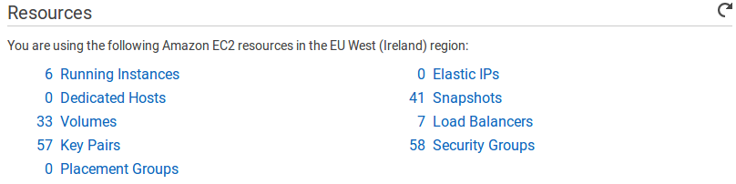

Seleccionaremos **Running Instances**. De esta forma podemos ver todas las instancias anteriormente creadas y podremos configurar nuevas:

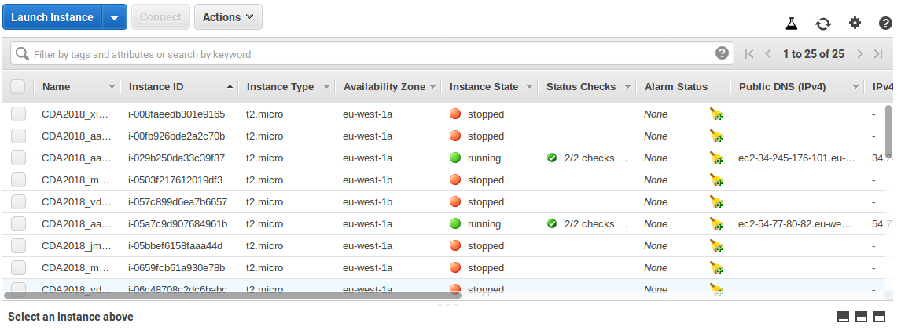

Pulsaremos en **Launch Instance** y procederemos a crear una nueva instancia.

En nuestro caso deseamos que sea un `Ubuntu Server 14.04 LTS`, así que buscaremos la AMI correspondiete.

> **Cuestión1** Una *Amazon Machine Image* o *AMI* es un máquina virtual preconfigurada que será usada por *Amazon EC2* para crear instancias, es decir, máquinas virtuales clon de las *AMI* usadas por el usuario.
>
> De esta forma, una misma *AMI* sirve para crear múltiples instancias.

Como se puede observar, es necesario marcar la casilla **Free tier only** para evitar costes imprevistos.

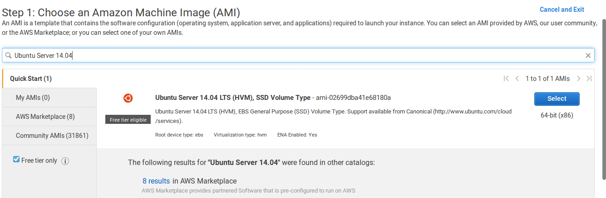

De esta misma forma, escogeremos el tipo de instancia **t2.micro**, dado que es aquella pertenenciente al **Free tier**, y pulsamos **Next: Configure Instance Details**.

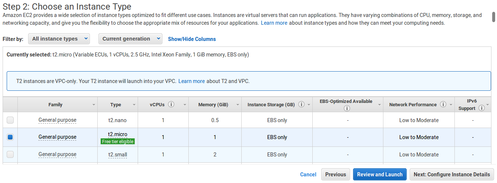

Entre todas las opciones disponibles, nos aseguramos de que **Shutdown behaviour** esté en **Terminate**.

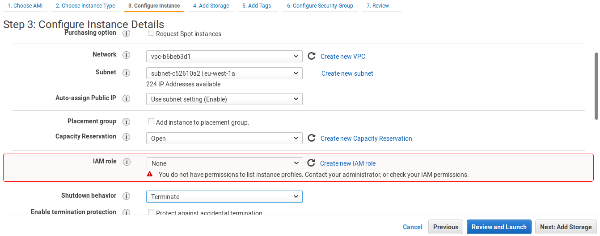

Pulsaremos en **Next: Add Storage** y seguido en **Next: Add tags**, dado que nos sirve la opción por defecto de almacenamiento.

En los tags añadiremos la etiqueta **Name** con el valor **CDA2018_usuario**:

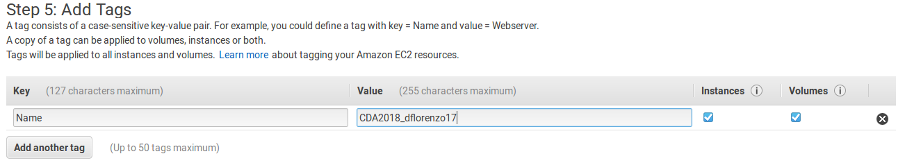

Por último configuraremos los **Security Groups** de tal forma que sólo nos podamos conectar desde nuestro equipo. Seleccionaremos un tipo de conexión SSH(22/TCP) desde nuestra IP:

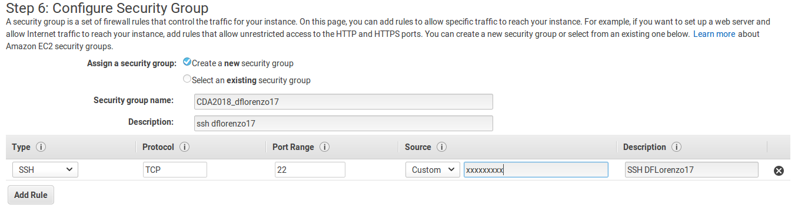

Aceptamos todo y lanzamos nuestra instancia.

Si no tenemos un par de claves creados, los generaremos de la siguiente forma:

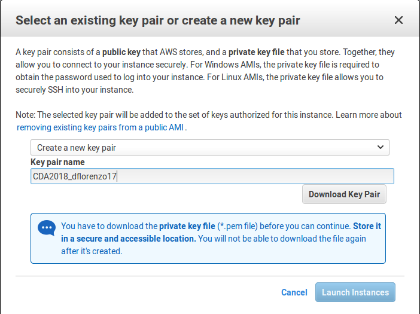

¡Y ya estaría! Nuestra instancia de un Ubuntu Server 14.04 LTS estaría siendo ejecutada ahora mismo:

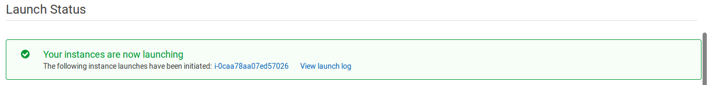


## Uso de la instancia creada
---
Para conectarnos a nuestra nueva instancia, usaremos el siguiente comando:

```bash
ssh -i <archivo .pem> <usuario>@<EC2 DNS (IPv4)>
# En mi caso:
ssh -i Downloads/CDA2018_dflorenzo17.pem ubuntu@ec2-34-240-246-60.eu-west-1.compute.amazonaws.com
```

Al entrar deberíamos ver la siguiente salida:

```
Welcome to Ubuntu 14.04.5 LTS (GNU/Linux 3.13.0-161-generic x86_64)

 * Documentation:  https://help.ubuntu.com/

  System information as of Sun Dec 30 15:49:12 UTC 2018

  System load:  0.0               Processes:           98
  Usage of /:   10.3% of 7.74GB   Users logged in:     0
  Memory usage: 5%                IP address for eth0: 172.30.0.171
  Swap usage:   0%

  Graph this data and manage this system at:
    https://landscape.canonical.com/

  Get cloud support with Ubuntu Advantage Cloud Guest:
    http://www.ubuntu.com/business/services/cloud

0 packages can be updated.
0 updates are security updates.

New release '16.04.5 LTS' available.
Run 'do-release-upgrade' to upgrade to it.


The programs included with the Ubuntu system are free software;
the exact distribution terms for each program are described in the
individual files in /usr/share/doc/*/copyright.

Ubuntu comes with ABSOLUTELY NO WARRANTY, to the extent permitted by
applicable law.

ubuntu@ip-172-30-0-171:~$
```

#### Instalación de un servidor web con PHP
---
Ejecutaremos los siguientes comandos para instalar el servidor web:

```bash
sudo apt-get update -y
sudo apt-get install -y apache2
sudo service apache2 restart
```

Si intentamos acceder a la dirección DNS(IPv4) desde el navegador, no obtendremos respuesta.

Para ello deberemos añadir la regla HTTP al Security Group:

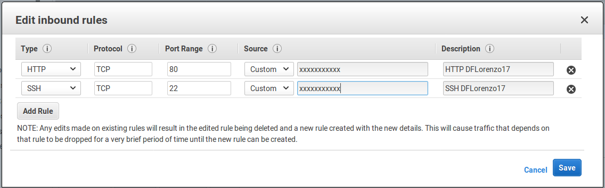

De esta forma ya podemos acceder al servidor web a través de nuestro navegador:

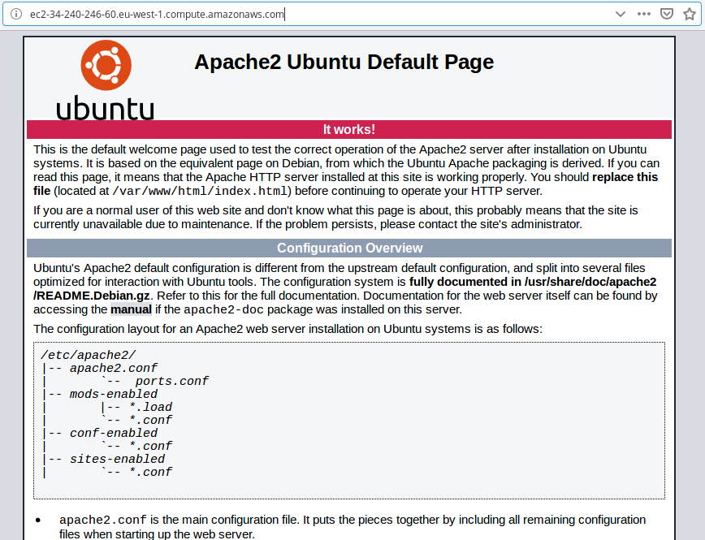

Ahora sólo falta instalar PHP ejecutando el comando:

```bash
sudo apt-get install -y php5
```

Crearemos un archivo **phpinfo** con la siguiente instrucción:

```bash
echo "<?php phpinfo(); ?>" | sudo tee /var/www/html/index.php
```

Si intentamos acceder desde el navegador a la página `index.php`, deberíamos ver algo similar a esto:

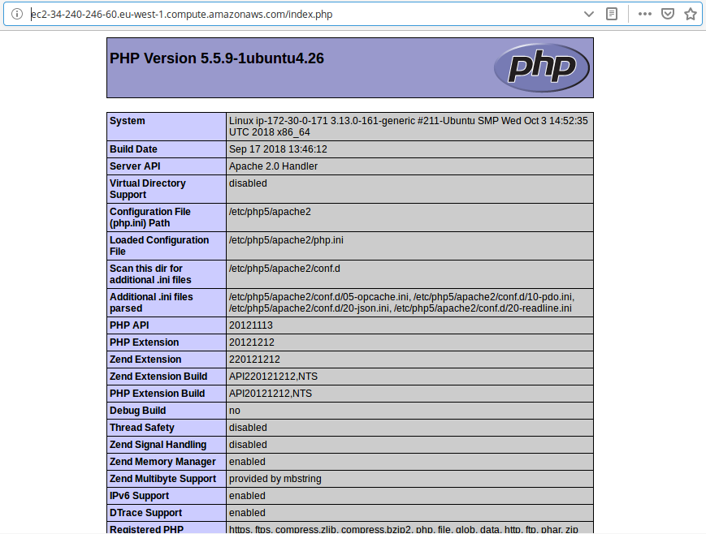


#### Detención de la instancia
---
Para detener la instancia, la seleccionaremos en el Panel de Control de Amazon EC2 y en **Actions** pulsaremos la opción **Stop**:

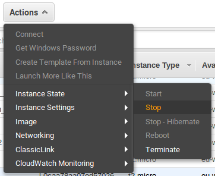


## Bibliografía
---
- [x] https://github.com/Student-Puma/HomeLab
- [x] https://www.dev-metal.com/install-setup-php-5-6-ubuntu-14-04-lts/
- [x] https://www.digitalocean.com/community/tutorials/como-instalar-linux-apache-mysql-php-lamp-en-ubuntu-16-04-es
- [x] https://cursos.faitic.uvigo.es/tema1819/claroline/document/goto/index.php/2018-2019/AWS-EC2_2018.pdf
