# S3 y Load Balancers

## Tabla de contenidos
---
- Introducción al entorno de prácticas
- Creación y Configuración del Bucket (Consola S3)
- Cargar objetos en el Bucket (Consola S3)
- Creación de las Instancias y vinculación con el Bucket (Consola EC2)
- Creación y Configuración del Balanceador (Consola EC2)
- Modificar el Security Group de las instancias (Consola EC2)
- Bibliografía


## Introducción al entorno de prácticas
---
Entramos en la consola de desarrolladores AWS pertenenciente a CDA:

```sh
https://cdaesei.signin.aws.amazon.com/console
```

Una vez dentro, nos logueamos con los siguientes datos:

> **Cuenta** cdaesei

> **Usuario** `censurado`

> **Contraseña** `censurado`

Trabajaremos siempre sobre el servidor **EU (Ireland)**.
Por otra parte, todas las instancias que levantemos serán **"Free tier eligible"** y **"Shutdown behaviour: Terminate"**.

Por último, incluirán obligatoriamente el prefijo **CDA2018_**.

Seguir cualquier indicación mostrada en [esta página](https://cursos.faitic.uvigo.es/tema1819/claroline/document/goto/index.php/2018-2019/AWS-EC2_2018_-_S3_-_Load_Balancers.pdf
) en caso de duda o error.


## Creación y Configuración del Bucket (Consola S3)
---
Entraremos en los servicios **S3** de AWS y le daremos a **Crear Bucket**.

Le pondremos un nombre y dejaremos como región *EU (Ireland)*.

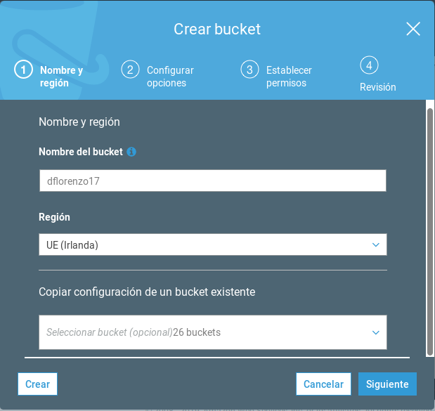

> **Cuestión 1**: Un bucket se crea en una determinada región, como el resto de servicios AWS, pero se pueden gestionar accesos públicos, los cuales son globales.

Las opciones del `bucket` las dejaremos por defecto salvo los permisos, los cuales *setearemos* como públicos dejándolos de la siguiente manera:

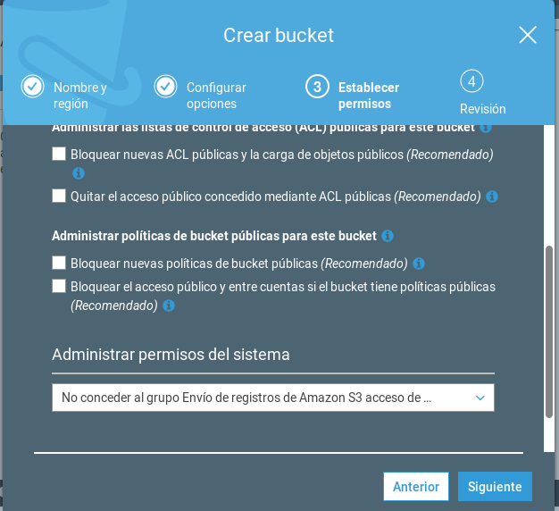


## Cargar objetos en el Bucket (Consola S3)
---
Una vez creado el `bucket`, cargaremos diversas imágenes con el formato `imgX.png`.

Para ello seleccionamos **Cargar** y subiremos los archivos de la siguiente manera:

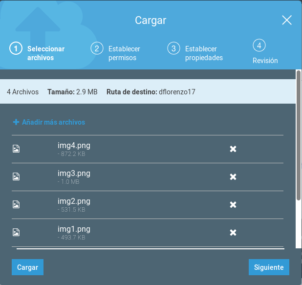

Como permisos pondremos **Public/Read**:

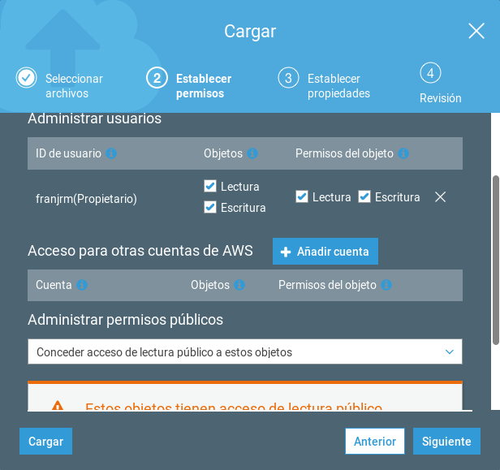

## Creación de las Instancias y vinculación con el Bucket (Consola EC2)
---
Ahora crearemos una **instancia EC2** igual que en la práctica anterior (la de introducción a AWS):

> Creamos una instancia Ubuntu Server 14.04


Nos conectamos a ella mediante SSH e instalamos **Apache2 con PHP** usando el siguiente comando:

```bash
sudo apt-get install -y apache2 php5
```

A continuación, creamos el archivo `/var/www/html/index.php` con el siguiente contenido:

```php
<html>
  .png"/>
</html>
```

De esta forma, este servidor mostrará dos de las cuatro imágenes subidas al `bucket`.

---

Realizamos una copia de la instancia usando alguna de las metodologías de la práctica anterior y modificamos el fichero `/var/www/html/index.php` para que ahora muestre las otras 2 imágenes subidas:

```php
<html>
  .png"/>
</html>
```

> **Cuestión 2**: En este caso, la segunda instancia ha sido creada usada el método de `Launch More Like This` y configurándola manualmente igual que la primera.

Además, modficaremos la **Instancia** para que se despliegue en una `zona de disponibilidad` diferente a la anterior:

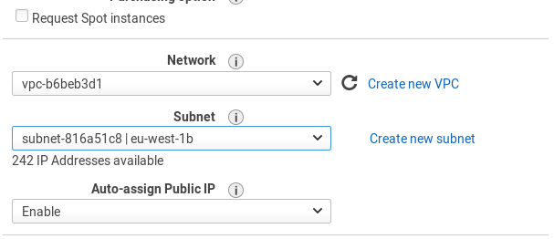

> **Cuestión 3**: En este caso, tanto el `par de claves` como el `Security Group` son los mismos que en la primera instancia, dado que lo que queremos son copias del mismo servidor, por lo que si hay que modificarlos, es mucho más rápido y sencillo.

Por último, comprobamos que ambas instancias funcionan correctamente.

> La cada instancia debería mostrar aleatoriamente dos imágenes, las cuales serán distintas dependiendo de la instancia.


## Creación y Configuración del Balanceador (Consola EC2)
---
En la consola **EC2** de AWS seleccionamos **Load Balancers** y creamos uno nuevo que sea `internet-facing` en el puerto 80:

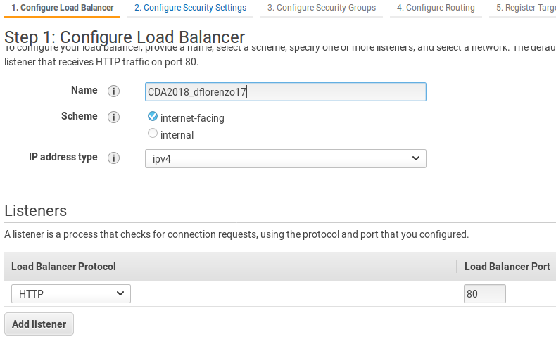

Seleccionamos las `zonas de disponibilidad` de las instancias creadas anteriormente:

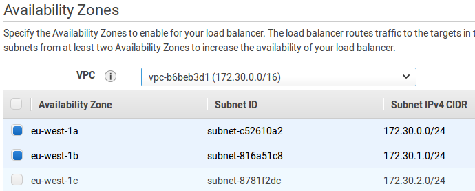

Creamos, además, un nuevo **Security Group** para el puerto 80:

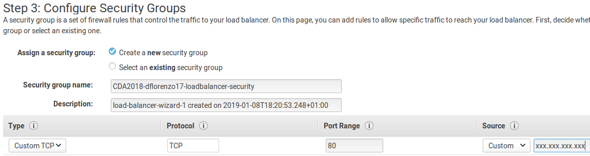

> **Cuestión 4**: En este caso, como se trata de un servidor HTTP, el `Security Group` del **Load Balancer** permite el acceso a través del puerto 80, pero no del puerto 22(SSH), dado que si no se *randomizarían* las conexiones por este protocolo y en ocasiones será necesario conectarnos a una instancia en concreto.

Configuramos el enrutamiento hacia las instancias:

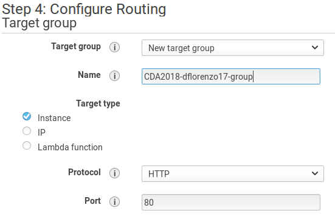

Y registramos como **targets** dichas instancias:

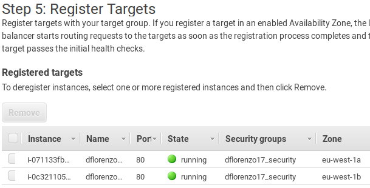


## Modificar el Security Group de las instancias (Consola EC2)
---
Sólamente nos queda modificar las **inbound conexions** de las instancias creadas.

Para ello modificamos el **Security Group** que comparten de la siguiente manera:

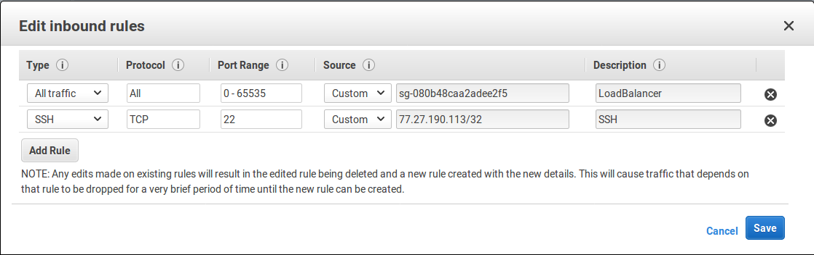

> **Cuestión 5**: Ahora las instancias tendrás una regla hija que adopte las características del **Security Group** padre (el del Load Balancer) y además, cada una tendrá un regla SSH por el motivo comentando en la `cuestión 4`.

Obtenemos la **dirección DNS** del **Load Balancer** y ¡comprobamos que funciona!

> Ahora deberían mostrarse aleatoriamente una de las cuatro imágenes que contiene el bucket, dado que las peticiones se distribuyen entre ambas instancias.


## Bibliografía
---
- [x] https://github.com/Student-Puma/HomeLab
- [x] https://docs.aws.amazon.com/es_es/AmazonS3/latest/dev/UsingBucket.html
- [x] https://docs.aws.amazon.com/es_es/AWSEC2/latest/UserGuide/using-regions-availability-zones.html
- [x] https://cursos.faitic.uvigo.es/tema1819/claroline/document/goto/index.php/2018-2019/AWS-EC2_2018_-_S3_-_Load_Balancers.pdf
